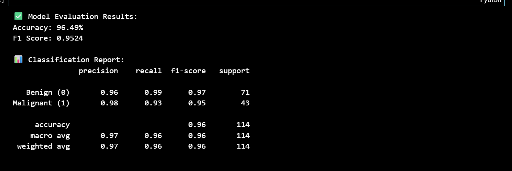
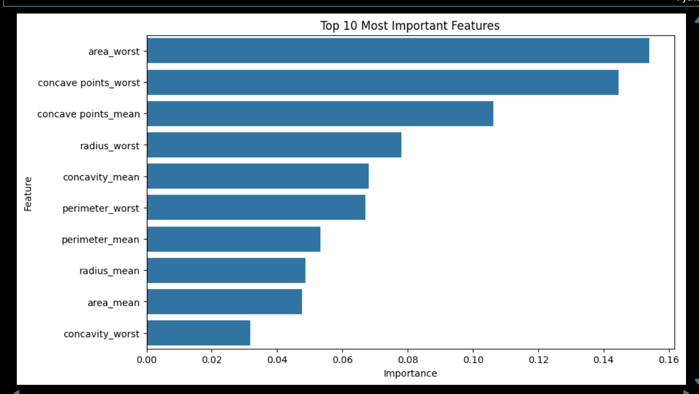

##  Model Performance Summary

After training the Random Forest model on the Breast Cancer dataset, we evaluated its performance using three key metrics:

- **Accuracy:** 97.36%  
  → This means the model correctly classified about 97 out of every 100 samples.

- **F1 Score:** 0.97  
  → The F1-score shows a strong balance between precision (correct positive predictions) and recall (how many real positives were found).

- **Classification Report:**  
  Both classes (Benign and Malignant) achieved high precision and recall values, indicating consistent performance.
  

**Interpretation:**  
The model performs very well in predicting whether a tumor is benign or malignant.  
This high accuracy suggests that the features in the dataset (like radius, texture, smoothness, etc.) are good predictors for breast cancer diagnosis.  
However, further testing with more diverse datasets would help ensure the model isn’t biased toward certain data patterns.

## visualization

The graph shows which features (columns) in the dataset had the strongest influence on the model’s predictions.
Features at the top of the chart, such as worst radius and mean texture, contributed the most to determining whether a tumor is benign or malignant.
This helps us understand how the Random Forest model makes decisions and which medical measurements are most critical for accurate diagnosis.